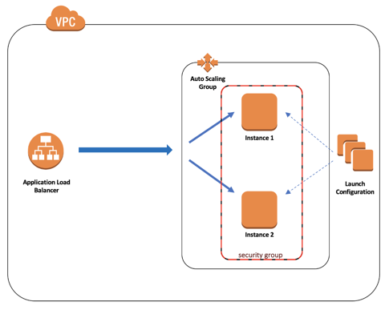

# Terraform hands-on exercise
## Prerequisites:
* Install Terraform CLI from https://learn.hashicorp.com/tutorials/terraform/install-cli#install-terraform
* Make sure you've got AWS credentials in `~/.aws/credentials`, `default` profile
## Running terraform:
For each of the layers use following commands:
- `cd <layer_directory>`
- `terraform init` - inits terraform configuration
- `terraform plan -var-file=../vars/dev.tfvars -out=tfplan.out` - creates a plan for the configuration. Outputs plan to `tfplan.out`
- `terraform apply "tfplan.out"` - applies previously created plan
- `terraform destroy -var-file=../vars/dev.tfvars` - destroys managed stack
## Task:
This terraform code is to deploy the schema outlined below  
* Go through the code and fix all TODOs.
* Better fix and apply layers one by one, rather fixing them all in first place
* Once all layers are deployed, check that you can access the ALB endpoint and see the web page
## Clean up:
Once exercise is completed (or you give up), please destroy all created resources. Ways to do that:
* For each of the layers (in descending order), run `terraform destroy -var-file=../vars/dev.tfvars`
* Or manually via AWS Console
